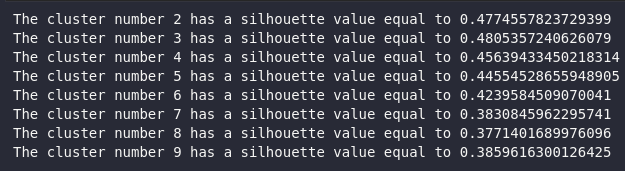

<div style="text-align: justify">

# Introdução
Na descrição do projeto Clustering, a primeira etapa a ser realizada pela equipe é a escolha de um banco de dados útil do <i>UCI Machine Learning Repository</i>. O Dataset escolhido para este trabalho específico em foi oi "<i>Wine Data Set</i>. Para acessar a página principal do repositório, <a href= "https://archive.ics.uci.edu/ml/datasets/wine"> clique aqui </a>. <br>
O banco de dados em questão tem como finalidade analisar quimicamente alguns atributos de diferentes vinhos. Os dados analisados podem servir para descobrir qual é a origem exata do produto. No total,  13 variáveis foram disponibilizadas para análise,  mas a equipe escolheu apenas 2 principais para realizar o tratamento dos dados: <i>Alcohol</i> e <i>Malic Acid</i>.


<br>
Após a filtragem dos dados a serem utilizados durante o projeto, a equipe definiu quais seriam os métodos utilizados para destacar e dar sentido às informações que foram colhidas do <i>Dataset</i>. Os mecanismos de análise foram estabelecidos e as suas bibliotecas em questão. Ao longo do relatório, as definições específicas ficarão mais claras através da utilização de trechos do código e imagens dos gráficos plotados.


# Fundamentos
Os modelos utilizados para o tratamento e análise dos dados foram:

## KMeans
<b>KMeans</b> é um dos métodos de Clustering mais utilizados no procedimento de métodos para Machine Learning ou para a análise de dados. Em poucas palavras, o processo de Clustering consiste em analisar informações e definir semelhanças e diferenças entre os dados. Variáveis em um mesmo aglomerado tendem a ser semelhantes entre si, enquanto dois aglomerados diferentes apresentam desconformidades significativas. <br>
 O algoritmo KMean é responsável por estabelecer um K número de clusters a ser definido dentro de um conjunto de dados. Cada ponto de dados é vinculado a um aglomerado e, no final, um ponto centróide é estabelecido como o centro do cluster.

### Elbow Method
Para aplicar o algoritmo, o K número de clusters é uma importante variável a ser considerada antes de começar a rodar o método. Portanto, um algoritmo matemático também deve ser estabelecido para que este valor não seja escolhido arbitrariamente.<br>
O <i>Elbow Method</i> é capaz de testar a variação que ocorre entre os dados quando o número de aglomerados muda. Estes valores são plotados e o deve-se encontrar um ponto de curvatura no gráfico semelhante a um "cotovelo".

### Silhouette Values
Além do Elbow Method, o <b>Silhouette Method</b> (ou Método Silhouette) também é uma outra possibilidade para achar o número ótimo de clusters em um conjuntod de dados. O algoritmo realiza esta operação medindo a distância de um determinado ponto de um aglomerado para outro aglomerado. A <i>range</i> do método silhouette varia de -1 para +1, onde valores próximos a 1 indicam que os pontos de cada cluster estão muito afastados, enquanto valores próximos à 0 indicam que os pontos de cada cluster estão muito próximos ou criando intersecções entre si.

## KMedoids
Assim como o algoritmo KMeans, o KMedoids também é responsável por particionar o conjunto de datos em aglomerados de variáveis semelhantes entre si. Contudo, existem diferenças cruciais entre os algoritmos que fazem com que o cálculo dos centróides e sua plotagem gráfica seja um pouco diferente.
- Os centróides no método KMeans é calculado através da média entre todos os <i>data points</i> de um aglomerado. Já o centróide de um cluster no método KMedoids é, literalmente, um determinado ponto de dados do cluster.
- O método KMean usa os conceitos Euclidianos para realizar os cálculos de distância entre os pontos de dados e o centróide de um cluster. Já o método KMedoids usa a soma das diferenças absolutas entre cada coordenada.
## DBSCAN
O algoritmo DBSCAN realiza o agrupamento de dados em <i> clusters</i> através do conceito de densidade das informações contidas em um dataset. O método cria suposições para definir um aglomerado: para o DBSCAN, um cluster é uma região densa do gráfico que está separado por regiões de menor densidade. É como pensar em uma ilha (região muito densa) cercada pela água (áreas de pouca densidade.) <br>
O algoritmo apresenta duas variáveis importantes: o Epsilon, que determina um raio a ser criado em torno de cada ponto de dados para a verificação de densidade; e os minPoints, que estabelece o número mínimo de pontos de dados dentro de um círculo para que aquela região seja considerada central.

# Metodologia
A primeira etapa no desenvolvimento do projeto foi, obviamente, preparar o banco de dados escolhidos para a análise nos métodos apresentados em sala de aula (KMeans, KMedoids, etc):
``` Python
df = pd.read_csv("https://archive.ics.uci.edu/ml/machine-learning-databases/wine/wine.data", usecols=[1, 2], names=['Alcohol', 'Malic acid'])
```
O código acima utiliza um dos métodos da biblioteca <i>Pandas</i> para poder exportar o Dataset da web para ser rodado no código. <i>usecols</i> é utilizado para filtrar a quantidade de colunas, pois a equipe do projeto tinha interesse em trabalhar com um array bidimensional por fins de plotagem. <br>
Após selecionados os dados necessários para a realização do projeto, os métodos <i>Elbow</i> e <i>Silhouette</i> foram utilizados para encontrar o número ótimo de K-Clusters a serem selecionados no algoritmo KMeans:
### Elbow method code
Como explicado anteriormente, o Elbow Method procura achar um ponto do gráfico de K Values que seja semelhante a forma de um cotovelo. Isto só é possivel ao rodar um loop <i>for</i> de valores KMeans presentes em uma faixa de 1 a 10 para encontrar qual é o perfeito:
```Python
sse = [] #list of the sum of squared distance between the data points in each cluster
listk = list(range(1,10))

#interact with each k number possibility to find an elbow curve
for k in listk:
    kmeans = KMeans(n_clusters=k)
    kmeans.fit(df)
    sse.append(kmeans.inertia_)

```
Usando o método KElbowVisualizer:

```Python
model = KMeans()
visualizer = KElbowVisualizer(model, k=(1,10))
```
No final, a plotagem gráfica do método Elbow foi a seguinte:


### Silhouette method code
Assim como no método Elbow, o método Silhouette também é utilizado para encontrar o K Value a ser utilizado no algoritmo KMeans. O código abaixo utiliza o método <i>metrics.silhouette_score</i> para computar os valores e printá-los logo em seguida:
```Python
for i in range(2,10): #loop para testar cada valor de KMean entre 2 e 10 paa descobrir qual eh o K perfeito
    kmean_cluster = KMeans(n_clusters= i)
    preds = kmean_cluster.fit_predict(df)
    kmeans_center = kmean_cluster.cluster_centers_

    score = metrics.silhouette_score(df, preds)
    print(f'The cluster number {i} has a silhouette value equal to {score}')
```
Os valores Silhouette encontrados foram:

A partir dos resultados encontrados através de ambos os métodos, é possível afirmar que o K Value perfeito é igual à 3.

## KMeans
Ao achar o K Value a ser utilizado no método KMeans, a aplicação no código foi a seguinte:
```Python
km = KMeans(n_clusters=3).fit(df)
cluster_labels = km.fit_predict(df)

centroids = km.cluster_centers_
```
Com o valor do centro dos cluster (guardados na variável <i>centroids</i>), podemos plotar os aglomerados e seus devidos centroides:


## KMedoids
Para o cálculo dos KMedoids, foi usado o método <i>KMedoids</i> da biblioteca <i>sklearn</i>. A diferença deste algoritmo para o KMeans é que, neste caso, os centroides são, de fato, representados por um ponto do aglomerado:

```Python
kmedoids = KMedoids(n_clusters=3, random_state=1).fit(df)

kmds_labels = kmedoids.fit_predict(df)
kmds_center = kmedoids.cluster_centers_
```
Como resultado, tivemos a seguinte plotagem que apresenta semelhanças ao KMeans, mas com sutis diferenças na posição dos centroides:


## DBSCAN
Por fim, o último algoritmo de clustering utilizado foi o de DBSCAN, que utiliza o conceito de densidade para estabelecer os pontos de dados semelhantes e capazes de formar um cluster. Antes de rodar o método, deve-se encontrar o valor de Epsilon (eps):

```Python
neighb = NearestNeighbors(n_neighbors=2)
nbrs = neighb.fit(df)
dist, ind = nbrs.kneighbors(df)

dist = np.sort(dist, axis = 0)
dist = dist[:, 1]

plt.figure(figsize=(6,6))
plt.plot(dist)
plt.show()
```

Após encontrar o valor <i>eps</i>, é possível rodarmos o algoritmo e realizar a plotagem do gráfico:

```Python
from sklearn.cluster import KMeans, DBSCAN

dbs_cluster = DBSCAN(eps = 0.4, min_samples= 4).fit(df)

dbs_labels = dbs_cluster.labels_

plt.figure(figsize=(6,6))
plt.scatter(df.iloc[:, 1], df.iloc[:, 0], c = dbs_labels, cmap='plasma')
plt.show()
```


# Resultados

Os resultados encontrados pelo método Elbow e pelo Silhouette definiram que o melhor K Value de Cluster é igual a 3, como definido anteriormente. Através da visualização dos dados plotados, notam-se três grandes aglomerados de dados e seus respectivos centróides. Estes três clusters formados indicam particularidades presentes nos vinhos estudados no que tange às propriedades do álcool e do ácido málico contidos nestes produtos. <br>
Contudo, há um problema a ser discutido nas conclusões do projeto: as distâncias intra e intercluster não estão em condições que favorecem os cálculos do método clustering. Inclusive, estes dados coletados são validados pelos valores que encontramos ao rodar o código do Silhouette: todos o K números testados não chegam próximos ao valor de 1, que é indicado como o silhouette value perfeito.<br>
Por fim, o DBSCAN demonstra uma forma diferente de olhar para a análise de clustering. Em vez de analisarmos a formação de aglomerados pela distância entre clusters, analisaremos pela densidade dos pontos de dados. O algoritmo encontrou uma região específica muita densa inserida no dataset dos vinhos, informação que não é captada no KMeans nem no KMedoids. 

# Conclusões

Os algoritmos de clustering KMeans e KMedoids podem não ser boas alternativas para analisar os dados presentes no wine dataset. O número de clusters indicado pelo Elbow e pelo Silhouette é o perfeito (k = 3) para a situação, mas os aglomerados estão exageradamente próximos entre si. <br>
Para que uma análise de clustering seja boa o suficiente, o espaço intracluster (entre os pontos de um mesmo aglomerado) deve ser o mínimo possível e o intercluster (entre os pontos de diferentes aglomerados) deve ser o máximo possível. O que se percebe, na verdade, é que os três clusters estão muito próximos entre si. Ou seja, não há uma diferença significativa entre os pontos de dados apresentados.<br>
A análise pode ter sido mais significativa a partir do DBSCAN, que apresentou dois aglomerados dentro do banco de dados. Há um aglomerado gigantesco (na cor rosa), enquanto há um bem menor (na cor amarela), que representam pontos de densidade. Os pontos azuis indicam os noise points, ou seja, dados que “soltos” que não conseguem se ligar a nenhum cluster.
</div>